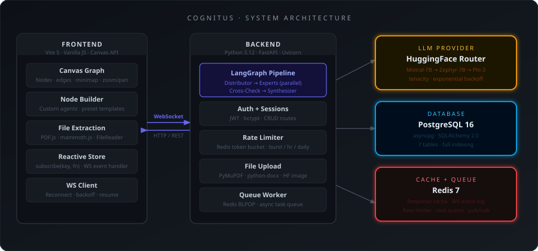
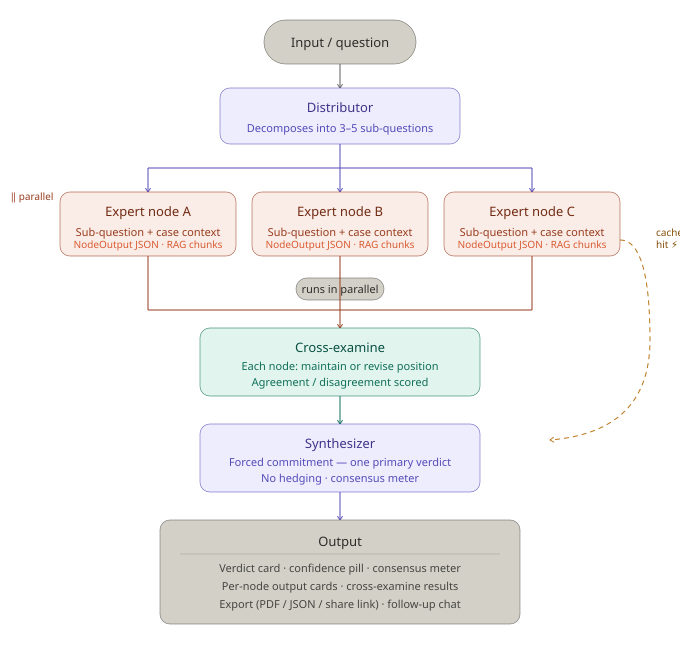

# Cognitus

> Multi-perspective AI reasoning platform powered by HuggingFace LLMs — with full Case Study Mode.

Cognitus operates in two modes:

- **Standard Mode** — Type a question and get analysis from dynamically selected AI expert agents in real time.
- **Case Study Mode** — Upload real case files (PDFs, images, documents), define custom expert nodes with tailored behaviors, and run a grounded multi-agent analysis on the uploaded content.

Everything streams to an animated canvas graph via WebSocket.

## Architecture



## Pipeline



### Pipeline Flow

1. **Case Decomposer** — The Distributor breaks the situation into 3–5 specific, independent sub-questions, each assigned to a domain
2. **Expert Nodes** — Each expert receives their *specific sub-question* plus the full situation as context, producing focused, non-overlapping analyses
3. **Cross-Check** — Identifies contradictions and agreements between experts
4. **Synthesis** — Forced commitment: picks ONE primary recommendation, no hedging

### WebSocket Resilience

- **Auto-reconnect** — Frontend retries with exponential backoff (1s, 2s, 4s, 8s, 16s, max 5 attempts)
- **Event History** — Last 100 events per session stored in Redis (10min TTL)
- **Resume on Reconnect** — Missed events are replayed; partial node results recovered
- **In-memory Rate Limiter** — Falls back when Redis is unavailable (single-process only)

## Tech Stack

| Layer | Technology |
|-------|-----------|
| LLM Provider | HuggingFace Inference API (Router) |
| Backend | FastAPI + Uvicorn + WebSockets |
| Frontend | Vanilla JS + Canvas API + Vite |
| Document Extraction | PDF.js (browser), mammoth.js (browser), PyMuPDF (server), python-docx (server) |
| Database | PostgreSQL 16 (async via asyncpg) |
| ORM | SQLAlchemy 2.0 async |
| Cache | Redis 7 |
| Auth | JWT + bcrypt |
| Container | Docker + Docker Compose |

## Prerequisites

- Python 3.11+
- Node.js 20+
- Docker & Docker Compose (optional, for postgres/redis)
- HuggingFace API token ([get one free](https://huggingface.co/settings/tokens))

## Quick Start

```bash
# Clone and enter
git clone https://github.com/MKarthik730/cognitus.git
cd cognitus
git checkout case-study

# Environment
cp .env.example .env
# Edit .env with your HF_API_TOKEN and a SECRET_KEY

# Start everything with Docker
docker compose up --build
```

### Manual Development Setup

```bash
# Backend
python -m venv .venv
source .venv/bin/activate   # Windows: .venv\Scripts\activate
pip install -r backend/requirements.txt
pip install PyMuPDF python-docx   # for file extraction

# Frontend
cd frontend
npm install
cd ..

# Start infrastructure (or set REDIS_URL / DATABASE_URL to skip)
docker compose up -d postgres redis

# Run backend (port 8000)
uvicorn backend.main:app --reload --port 8000

# Run frontend (separate terminal, port 5173)
cd frontend && npm run dev
```

> **Note:** The backend starts without Redis/Postgres — it logs a warning and runs in standalone mode for WebSocket testing.

## Case Study Mode — Feature Details

### File Upload & Extraction

Switch to the **Case Study** tab in the left panel to access the file drop zone.

| File Type | Extraction Method |
|-----------|------------------|
| PDF | PDF.js in-browser, PyMuPDF on server |
| DOCX | mammoth.js in-browser, python-docx on server |
| PNG / JPG / WEBP | Base64 → HF Inference API for description |
| MD / TXT / CSV | FileReader API as plain text |

- Multiple files allowed
- Per-file extraction status (spinner → ready/failed)
- Failed files show retry button, excluded from analysis

### Node Builder

Define 2–6 custom expert nodes with:

- **Name** — Displayed in graph and panels
- **Role** — One-line description
- **Behavior** — Full system prompt controlling reasoning style
- **Color** — Pick from 8 preset colors per node
- **Collapse / Expand** — Toggle to show only the name
- **Duplicate** — Clone a node with "(copy)" suffix
- **Reorder** — Via drag handle
- **Delete** — Disabled when only 2 nodes remain

### Preset Templates

| Template | Nodes |
|----------|-------|
| Medical Team | Cardiologist, Intensivist, Pharmacologist, Risk Assessor |
| Detective Squad | Evidence Analyst, Forensic Pathologist, Psychologist, Legal Advisor |
| Startup Review | Investor, CFO, Market Analyst, Devil's Advocate |
| Legal Panel | Prosecution, Defense Counsel, Forensic Expert, Judge |
| Engineering Review | Backend Engineer, Security Analyst, DevOps Lead, QA Engineer |
| Custom | Starts with 2 empty node slots |

Each preset ships with detailed behavior prompts that control how the expert reasons.

### Context Pipeline

After extraction, before analysis:

1. **Assemble** — Concatenate all ready file contents
2. **Estimate** — If total > 6000 chars (~1500 tokens), run per-file summarization via HF model
3. **Compress** — If still > 10000 chars, run global compression pass
4. **Inject** — All nodes receive the same `CASE_CONTEXT` string

> ℹ A banner appears when context was condensed: *"Case files condensed to fit analysis limits."*

### Node Execution

All nodes run in parallel. Each receives:
- Their **behavior** system prompt
- The **case context**
- Their **specific sub-question** (from the case decomposer)
- The **guiding question** (optional)

Each response is parsed as **structured JSON** matching a Pydantic `NodeOutput` schema (`confidence`, `position`, `reasoning`, `key_findings`, `concerns`). Responses with markdown fences are auto-cleaned, validated, and hallucination-checked before acceptance.

On JSON parse failure, the node is re-prompted once. If both attempts fail, the node is marked as error and excluded from synthesis.

### Output

**Verdict tab:** Verdict card with confidence pill · Consensus meter (0–100% gradient) · Critical Findings · Unresolved Disagreements · Numbered Recommendations · Full Reasoning block

**Node Outputs tab:** One card per node with colored left border · Position · Key Findings · Concerns · Reasoning (collapsible) · Cross-Check card at bottom

## Standard Mode — Case Decomposition + Expert Analysis

In Standard mode, the **Distributor** (case decomposer) breaks the situation into 3–5 specific analytical sub-questions, each assigned to a domain. Then the **Node Selector** (running `meta-llama/Llama-3.2-1B-Instruct`) evaluates the situation and selects 3–5 relevant expert roles on the fly. Each expert receives their *specific sub-question* plus the full situation as context.

Responses are parsed as **structured JSON** (Pydantic `NodeOutput` schema). On parse failure, falls back to 3 generic nodes (Analyst, Critic, Synthesist).

Model fallback chain: `Llama-3.2-1B-Instruct` → `DeepSeek-R1-Distill-Qwen-1.5B` → `Arch-Router-1.5B`

## WebSocket Resilience

The frontend includes automatic reconnection with exponential backoff (1s, 2s, 4s, 8s, 16s, max 5 attempts). If the WebSocket disconnects mid-analysis:

1. The frontend tracks the last received event ID
2. On reconnect, it sends a `resume` message with the session ID and last event ID
3. The backend replays missed events from Redis (last 100 events, 10min TTL)
4. Partial node results are recovered for nodes that hadn't completed yet
5. After 5 failed attempts, the UI shows "Connection lost — Click Retry"

## API Endpoints

| Method | Path | Description |
|--------|------|-------------|
| POST | `/api/auth/register` | Register new user |
| POST | `/api/auth/login` | Login, get JWT |
| GET | `/api/sessions` | List user sessions |
| POST | `/api/sessions` | Create session |
| GET | `/api/sessions/{id}` | Get session |
| DELETE | `/api/sessions/{id}` | Delete session |
| POST | `/api/analyze` | Run council analysis |
| GET | `/api/analyze/{id}` | Get completed analysis |
| WS | `/ws/{session_id}` | Real-time streaming graph events |
| POST | `/api/case-study/upload` | Upload file for case study extraction |
| GET | `/api/nodes` | List available expert domains |
| GET | `/health` | Health check |

## Project Structure

```
cognitus/
├── backend/
│   ├── app/
│   │   ├── agents/              # LLM-powered agent nodes
│   │   │   ├── distributor.py
│   │   │   ├── expert_node.py
│   │   │   ├── cross_check.py
│   │   │   └── synthesizer.py
│   │   ├── graph/               # LangGraph state machine
│   │   │   ├── state.py
│   │   │   └── council_graph.py
│   │   ├── api/                 # FastAPI routes + WebSocket
│   │   │   ├── routes/
│   │   │   │   ├── auth.py
│   │   │   │   ├── sessions.py
│   │   │   │   └── analyze.py
│   │   │   ├── upload.py        # Case study file upload
│   │   │   └── websocket.py     # Standard + case study WS handlers
│   │   ├── core/                # Config, DB, security
│   │   │   ├── config.py
│   │   │   ├── database.py
│   │   │   └── security.py
│   │   ├── services/            # HF API, node selector, etc.
│   │   │   ├── hf_service.py
│   │   │   ├── node_selector.py
│   │   │   ├── rate_limiter.py
│   │   │   ├── cache.py
│   │   │   └── queue_worker.py
│   │   ├── models/              # SQLAlchemy ORM models (7 tables)
│   │   └── schemas/             # Pydantic request/response schemas (NodeOutput, etc.)
│   │   └── node_output.py
│   └── __init__.py
│   ├── main.py
│   ├── requirements.txt
│   └── Dockerfile
├── frontend/
│   ├── src/
│   │   ├── app.js               # Main application logic
│   │   ├── store.js             # Reactive state store
│   │   ├── canvas.js            # Canvas graph rendering
│   │   ├── api.js               # WebSocket + HTTP client
│   │   ├── utils.js             # Helpers, colors, markdown, presets
│   │   ├── main.js              # Entry point
│   │   └── styles.css           # All styles (no CSS framework)
│   ├── index.html
│   ├── package.json
│   └── vite.config.ts
├── architecture.svg
├── pipeline.svg
├── docker-compose.yml
└── .env.example
```

---

## Dynamic Node Selection

Instead of a static panel of experts, Cognitus uses a **Node Selector** call before analysis:

1. The question is sent to `meta-llama/Llama-3.2-1B-Instruct` with a prompt asking for 3–5 domain-specific expert roles
2. Response is parsed as structured JSON
3. Each selected node gets an auto-generated role description and behavior prompt
4. Nodes appear in the left panel with a staggered fade-in animation
5. On parse failure, falls back to 3 generic nodes: Analyst, Critic, Synthesist

Model fallback chain: `Llama-3.2-1B-Instruct` → `DeepSeek-R1-Distill-Qwen-1.5B` → `Arch-Router-1.5B`
## Rate Limits

HuggingFace free tier limits enforced by the platform:
- 800 requests/day global
- 50 requests/hour per user
- 1 request per 2 seconds burst

## License

MIT
